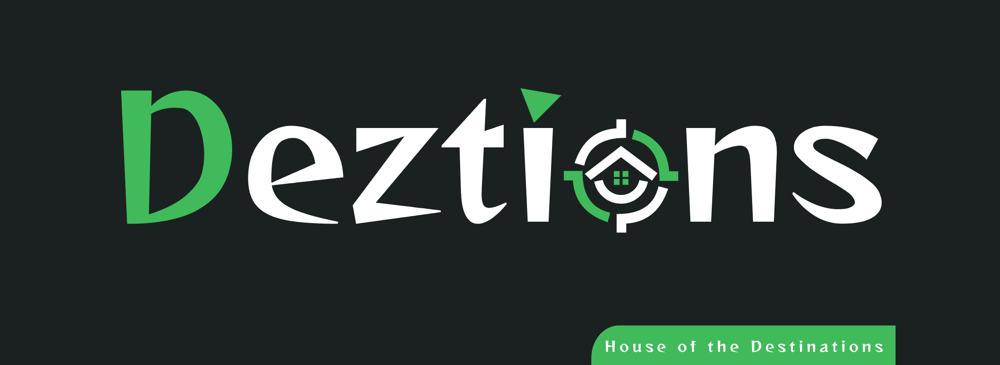

# Getting Started with Deztions

## Deztions Mobile Web View

This project is a ReactJs based social media platform that can share the locations someone is visited. Is it ineresting? yeah! exactly you can contribute for this project. (This is a react project and this is the frontend only)

## How to run this project in your environment

To run this project in your environment, download zip file or clone this project. After that, in the project directory, enter `npm install` for install node_modules.

To run this app in the development mode you can run `npm start` in your project directory and it will be open the web browser in https://localhost:3000/

## The Deztions is hosted with Netlify
 

This project is hosted in netliy.com and the used build command is `CI= npm run build` and publish directory is `build/` if you merge this project to main you can see the deployment status in above badge.

The site hosted link: https://agitated-noyce-875c3e.netlify.app/

Copyright (c) 2021 Thilina Pathirage
